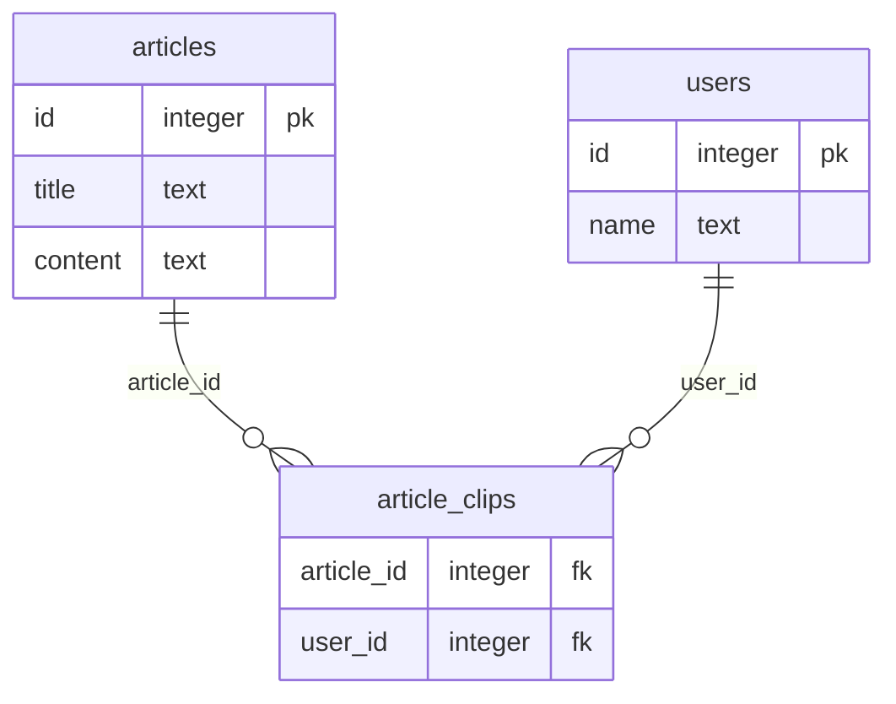

## 自己紹介

私は、現在とあるWeb系のベンチャーでWebアプリケーションエンジニアとして開発業務に従事しています。

今回の記事では以前勤務していた株式会社ZUUでの開発に関して投稿したいと思います。

今回は肥大化したDBにインデックスを付与することで、DBインスタンス数を最大6台から2台までに改善することができたので説明していきたいと思います。

**本記事は個人の見解です。**

## サービスについて

株式会社ZUUでは金融に関する記事を掲載する様々なメディアを運営しています。

ZUU Onlineやfuelle、MoneyTimes、dメニューマネー、その他にも多数メディアを運営しております。

一部メディアでは、ユーザー機能を提供しており、その中にお気に入りの記事をクリップする機能などがあります。

## 概要

弊社の顔でもZUU onlineは、ローンチして約○年経ち、記事数やユーザー数ともに大きく成長しました。ただその一方でパフォーマンスの劣化などが問題となりユーザビリティを下げてしまうことに課題がありました。

## 前提

使用しているDBMSはPostgreSQL12です。

今回改善したクエリを簡単な図で説明します。

運用しているメディアでは、ユーザーが記事をクリップする機能が提供されています。

その一部であるユーザーごとにクリップを取得する機能がボトルネックとなっていました。

（以下のテーブルは例です。実際のテーブルとは異なります。）



それぞれおおよそ以下のレコード数を持っています。

| テーブル名 | レコード数 |
| ---- | ---- |
| articles | 120,000 |
| article_clips | 2,800,000 |
| users | 200,000 |

## スロークエリの分析

スロークエリが判明したので、実行計画をもとに分析していきます。

### 問題のクエリ


### コストを確認する

まずはどこのデータの取得で実行時間がかかっているのか分析するため、コストを確認します。
分析したところ上から三番目のusersテーブルをJoinする処理にて、実行時間のほとんどを費やしていることがわかりました。

```sql
Seq Scan on users (cost=0.00..649209.11 rows=14315247 width=8) (actual time=0.028..5288.640 rows=14316944 loops=1)
```

ここからわかることは3つあります。

- Seq Scan on users：usersテーブルに対して、シーケンシャルスキャンによるデータの結合を行っている
- rows=14315247：処理が行われる対象の行数が推定14315247行
- (actual time=0.028..5288.640)：処理が行われる全体コスト5288.640ms

## 分析結果

article_clipsテーブルとusersテーブルのJoin時に全ての行に対して問い合わせを行い結合が行われることで**約5.2秒**という長い処理が行われていたことが原因です。

そのため、インデックスを付与することで必要最低限の問い合わせを行い結合するようにパフォーマンスチューニングをしました。

## インデックスの付与

以下がインデックス付与後の実行計画です。

インデックスが適用され、大幅にパフォーマンスが改善されたことを確認しました。


## インデックス付与の懸念

インデックスを付与するにあたり、以下のパフォーマンス劣化の

- インデックス付与前後でのデータ更新(INSERT、UPDATE、DELETE)
- インデックスの付与実行時に更新処理

インデックスの付与実行時に更新処理が著しく重くなるなどの懸念がありました。

そこで本番環境のDBをクローンし、検証を行ったところ約8秒のかかることがわかりました。

そのため、ピークの時間帯を避けてのインデックスの付与を行うことにしました。

## 処理時間の比較

インデックスの付与前後で約1000倍程度の改善を確認することができました。

### インデックス付与前

| | Planning Time | Execution Time |
| ---- | ---- | ---- |
| 一回目 | 5.158 ms | 4309.094 ms |
| 二回目 | 0.604 ms | 3437.310 ms |
| 三回目 | 0.543 ms | 3466.844 ms |
| 平均 | 2.101ms | 3737.749ms |

### インデックス付与後

| | Planning Time | Execution Time |
| ---- | ---- | ---- |
| 一回目 | 393.074 ms | 8.741 ms |
| 二回目 | 0.541 ms | 0.519 ms |
| 三回目 | 0.541 ms | 0.519 ms |
| 平均 | 131.374ms | 3.259ms |

## DBのCPUの効果

鬼改善しました。正直最初は、ちゃんとメトリクスが収集できていないのではと思いました。

**CPU使用率が60%から5%まで改善しました**

結果、DBインスタンスを最大6台から2台に削減することができました。（月30万ほどの削減見込み）


## まとめ

問題になったクエリは、開発当初からDBに高負荷を与えていたわけではなく、サービスが拡大することによってデータ数が増えたため生じた問題です。

ジョインするテーブルのレコードが300万件を超えているのにも関わらず、 Seq Scanによるデータの取得をしていることが原因で実行時間が3秒を超えるスロークエリとしてDBに高負荷を与えていました。

このように、サービス拡大にするにあたり発生するパフォーマンス劣化を検知する仕組みを用意することの大切さを学びました。
