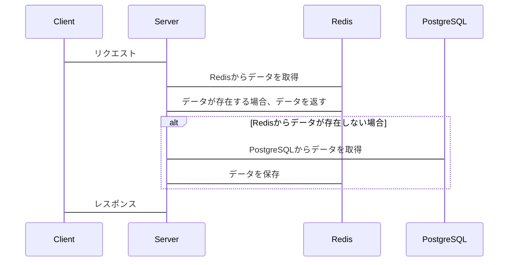

## はじめに

現在とある金融系Webメディアを運営する会社で、主にバックエンドの開発を担当しており、フロントエンド、インフラに関する業務も担当しています。

今回は、先輩エンジニアがデータ圧縮アルゴリズムを変更することでRedisの負荷を1/3に削減することに成功した実例をもとに記述して行きます。

- 先輩エンジニア(通称 [ichigozero](https://github.com/ichigozero))は、vimmer, hacker, rustが得意なエンジニアです。（共通の趣味（おうちKubernetes）について語り合うのが日課です。笑）

## サービスの概要

金融に関する記事を掲載するWebメディアを運用しています。

## 背景

現在運用しているメディアでは約100万記事掲載しており、直近一年で約50万記事と急激に増加し、Redisのパフォーマンスが劣化する課題がありました。

RedisのCPU使用率が高負荷状態になると、インスタンスを増やすことで一時的な対応を行っていました。

そこで根本的なアプローチをし、改善を行うとなったのが背景です。

*別アプローチも行っており、大幅な改善が見られました。別記事にて紹介する予定です。

## 前提

### データ取得のフロー

サーバーでは、Redis->PostgreSQLという順番で問い合わせを行っています。



## 解決策

データ圧縮アルゴリズムのGob形式から、パフォーマンスの高いアルゴリズムであるMgspack形式とSnappy形式を採用することで、大幅な改善に成功しました。

### 採用理由

データ圧縮のベンチマークについては、`Gob`と`Mgspack + Snappy`は同等のパフォーマンスです。

しかしバイトサイズを比較すると`Mgspack + Snappy`が`Gob`と比べ、半分のサイズに圧縮することができています。

結果、Redisのベンチマークを比べるとns/op(1回の操作にかかる平均時間)が約11%、B/op(1回の操作で消費する平均メモリ量)が約3%、allocs/op(1回の操作で生成される平均割り当て数)が約80%と大幅に改善したので採用しました。

### ベンチマーク

データ圧縮のベンチマーク

```zsh
BenchmarkJSONMarshal-12               	   45304	     25614 ns/op	   17984 B/op	      35 allocs/op
BenchmarkJSONUnmarshal-12             	   14763	     81072 ns/op	   31334 B/op	      74 allocs/op
BenchmarkGobMarshal-12                	  120536	     10011 ns/op	   29876 B/op	      51 allocs/op
BenchmarkGobUnmarshal-12              	   56109	     21446 ns/op	   36464 B/op	     243 allocs/op
BenchmarkMsgpackMarshal-12            	  373802	      2888 ns/op	   28005 B/op	       5 allocs/op
BenchmarkMsgpackUnmarshal-12          	  369746	      3261 ns/op	   15286 B/op	      34 allocs/op
BenchmarkMsgpackSnappyMarshal-12      	   55236	     21330 ns/op	   44386 B/op	       5 allocs/op
BenchmarkMsgpackSnappyUnmarshal-12    	  140824	      8507 ns/op	   28951 B/op	      35 allocs/op
```

Redisベンチマーク

```zsh
BenchmarkRedisGob-12                  	    3412	    354128 ns/op	   80158 B/op	     299 allocs/op
BenchmarkRedisMsgpackSnappy-12              3891	    318373 ns/op	   76750 B/op	      46 allocs/op
```

バイトサイズ

```zsh
json: 14602
gob: 13441
msgpack: 13304
msgpack + snappy: 7789
```

### 実装

[snappy](https://github.com/golang/snappy)と[Mgspack](https://github.com/vmihailenco/msgpack)をインストール

```zsh
go get github.com/golang/snappy \
go get github.com/vmihailenco/msgpack/v5
```

データ圧縮ロジックを変更

```golang
func serialize(value interface{}) ([]byte, error) {
  b, err := msgpack.Marshal(value) // 変更箇所
  if err != nil {
    return nil, err
  }
  return snappy.Encode(nil, b), nil // 変更箇所
}
func deserialize(input []byte, ptr interface{}) (err error) {
  b, err := snappy.Decode(nil, input) // 変更箇所
  if err != nil {
    return err
  }
  return msgpack.Unmarshal(b, ptr) // 変更箇所
}
```

## 結果

リリース直後から大幅な改善が見られ、ネットワークバイト数が約1/3の改善されました。

ピーク時にて最大約3.7Gbpsまで削減できたため、`cache.m7g.4xlarge`から`cache.m7g.2xlarge`へと[スペック](https://aws.amazon.com/jp/elasticache/pricing/)を下げることが可能となりました。（現在経過観察中）

以下はリリースを含めた直近2週間のメトリクスです。


## まとめ

歴史的な経緯でRedisのKey設計の見直しなど以前からもパフォーマンスチューニングを行ってきました。
今回はアルゴリズムの変更を行うことで、差分が短めにも関わらず影響度が高い改善を行うことに成功しました。
また、個人的にも様々な角度からアプローチすることでより強いインパクトを生み出せることを学びました。
これからも精進して行きたいなと思います！！！
